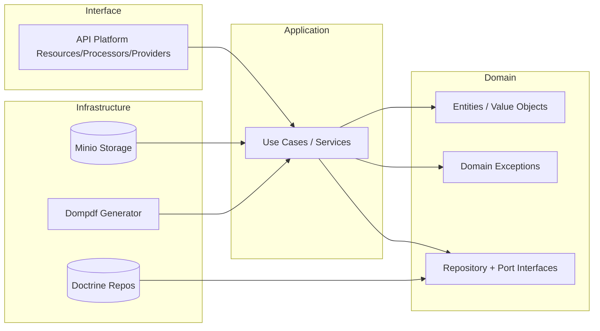

# Choix d’architecture

## Pourquoi l’hexagonal ?

- Isoler les règles métier du framework (Symfony) et des adapters (Doctrine, Minio, Dompdf).
- Faciliter les tests et l’évolution (ex : changer de storage PDF sans toucher au domaine).

## Découpage retenu

- **Domain** : entités, value objects, exceptions, interfaces de repositories et ports.
- **Application** : cas d’usage (services) et interfaces de ports.
- **Infrastructure** : implémentations concrètes (Doctrine, Minio, Dompdf).
- **Interface** : API Platform (resources, processors, providers).

## Diagramme (vue globale)

## Choix techniques présents

- **API Platform** pour exposer les ressources REST.
- **JWT + refresh token** pour sécuriser l’API.
- **Dompdf** pour la génération des PDFs.
- **Minio** (S3 compatible) pour stocker les PDFs.

