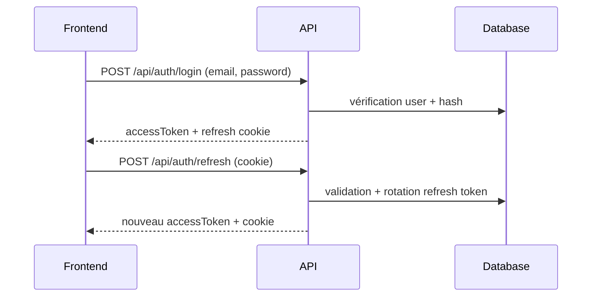

# Authentification

## Endpoints présents

- `POST /api/auth/register`
- `POST /api/auth/login`
- `POST /api/auth/refresh`
- `POST /api/auth/logout`

## Flux (login → refresh)



## Extraits de code (commentés)

### Authenticator JWT

```php
// api/src/Infrastructure/Security/JwtAuthenticator.php
public function authenticate(Request $request): Passport
{
    // 1) Extraction du header Authorization
    $authorization = $request->headers->get('Authorization', '');

    // 2) Validation du format Bearer
    if (!str_starts_with($authorization, 'Bearer ')) {
        throw new CustomUserMessageAuthenticationException('Missing access token.');
    }

    // 3) Parsing + validation du JWT
    $token = trim(substr($authorization, 7));
    $payload = $this->tokenManager->parse($token);

    // 4) Construction du passport (email dans le token)
    $email = $payload['email'] ?? null;
    return new SelfValidatingPassport(new UserBadge($email));
}
```

**Commentaire :** l’authenticator ne dépend pas de Doctrine ; il valide le JWT et laisse Symfony charger l’utilisateur via le provider.

### Login (génération tokens)

```php
// api/src/Application/Auth/LoginUserService.php
$accessToken = $this->tokenManager->createAccessToken($user);
$generatedRefreshToken = $this->refreshTokenGenerator->generate();

$refreshToken = new RefreshToken(
    $user,
    $generatedRefreshToken->tokenHash,
    $refreshTokenExpiresAt
);
```

**Commentaire :** le refresh token est stocké en base (hashé), l’access token est stateless.

## Sécurité appliquée

- Hash des mots de passe (PasswordHasher Symfony).
- Cookies HttpOnly pour le refresh token.
- Firewall stateless + authenticator JWT.
