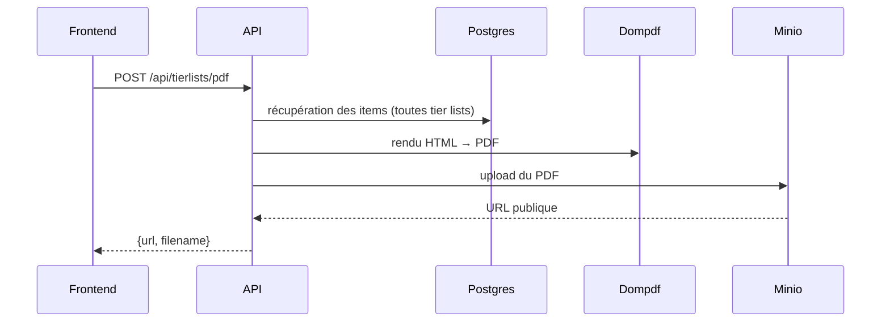

# Génération PDF (statistiques)

## Fonctionnement

- Endpoint : `POST /api/tierlists/pdf`.
- Le backend génère un **PDF de statistiques globales** (toutes les tier lists).
- Le PDF est stocké dans **Minio** puis l’API renvoie `{ url, filename }`.

## Flux



## Extraits de code (commentés)

### Use case de génération

```php
// api/src/Application/TierList/GenerateStatisticsPdfService.php
$allItems = $this->tierListRepository->findAllItems();
// ... calcul des stats par logo (S/A/B/C/D)
$pdfDocument = $this->pdfGenerator->generateStatistics($statistics);

$path = 'pdfs/' . $pdfDocument->filename;
$this->pdfStorage->store($path, $pdfDocument->content);

return new PdfDocument($pdfDocument->content, $pdfDocument->filename, $this->pdfStorage->getUrl($path));
```

**Commentaire :** le service applique la logique métier (statistiques) puis délègue le rendu et le stockage.

### Générateur Dompdf

```php
// api/src/Infrastructure/Pdf/DompdfGenerator.php
$options = new Options();
$options->set('isRemoteEnabled', true);

$dompdf = new Dompdf($options);
$dompdf->loadHtml($html, 'UTF-8');
$dompdf->render();
```

**Commentaire :** Dompdf rend le template Twig `pdf/statistics.html.twig` en PDF.

## Réponse API (structure)

```json
{
  "url": "<MINIO_PUBLIC_ENDPOINT>/<bucket>/pdfs/<filename>.pdf",
  "filename": "<filename>.pdf"
}
```

**Commentaire :** l’URL est construite à partir de `MINIO_PUBLIC_ENDPOINT` et `MINIO_BUCKET`.
