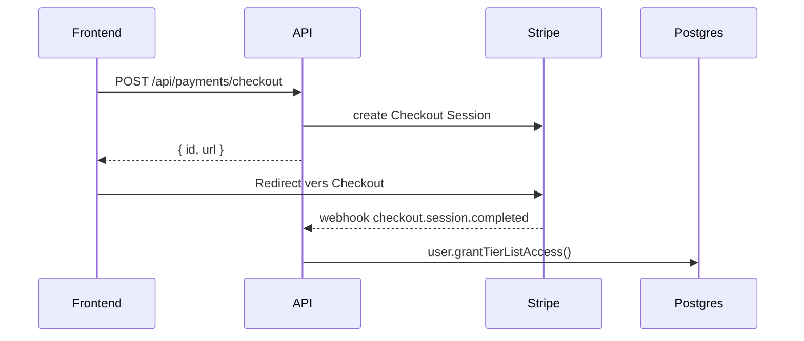

# Paiement Stripe (déblocage Tier List)

## Objectif

- Le **remplissage de la tier list** est bloqué tant que le paiement Stripe n’est pas validé.
- Après paiement, l’accès est activé en base via le webhook Stripe.

## Endpoints présents

- `POST /api/payments/checkout` → crée une session Checkout Stripe
- `GET /api/payments/status` → retourne `{ paid: boolean }`
- `POST /api/payments/webhook` → webhook Stripe (public)

## Flux principal



## Extraits de code (commentés)

### Création de session Checkout

```php
// api/src/Infrastructure/Payment/StripeGateway.php
$session = Session::create([
    'mode' => 'payment',
    'customer_email' => $user->getEmail(),
    'client_reference_id' => $user->getId(),
    'line_items' => [
        ['price' => $this->priceId, 'quantity' => 1],
    ],
    'success_url' => $this->successUrl,
    'cancel_url' => $this->cancelUrl,
    'metadata' => ['user_id' => $user->getId()],
]);
```

**Commentaire :** on associe la session à l’utilisateur via `client_reference_id` (et `metadata.user_id` en fallback).

### Webhook Stripe (validation)

```php
// api/src/Application/Payment/HandleStripeWebhook.php
$event = $this->stripeGateway->parseWebhookEvent($payload, $signature);
if ($event->type !== 'checkout.session.completed') {
    return;
}

$user = $this->userRepository->findById($event->userId);
if (!$user || $user->hasTierListAccess()) {
    return;
}

$user->grantTierListAccess();
$this->userRepository->save($user);
```

**Commentaire :** l’accès est débloqué uniquement sur `checkout.session.completed`.

### Blocage du remplissage de la tier list

```php
// api/src/Application/TierList/MoveLogoToTier.php
if (!$user->hasTierListAccess()) {
    throw new TierListPaymentRequiredException();
}
```

**Commentaire :** toute tentative de drag/drop côté API renvoie 402.

## Sécurité / erreurs

- Webhook public : `POST /api/payments/webhook` est autorisé sans authentification.
- Auth obligatoire sur `/payments/checkout` et `/payments/status`.
- `TierListPaymentRequiredException` → **HTTP 402** (voir `ApiExceptionSubscriber`).
- `StripeWebhookInvalidSignatureException` → **HTTP 400**.

## Configuration (env)

```
STRIPE_SECRET_KEY=sk_test_...
STRIPE_WEBHOOK_SECRET=whsec_...
STRIPE_PRICE_ID=price_...
STRIPE_SUCCESS_URL=http://localhost:3000?payment=success
STRIPE_CANCEL_URL=http://localhost:3000?payment=cancel
```

**Commentaire :** le backend lit ces variables dans `StripeGateway` via `Autowire`.

## Frontend (résumé)

- Le bouton **“Débloquer avec Stripe”** déclenche `POST /api/payments/checkout`.
- Le status (`/api/payments/status`) contrôle si le drag & drop est actif.

